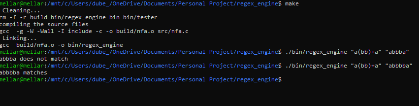

# regex_engine
This is an implementation of a regex_engine which takes a regular expression and a string and then tells you if the string is in the regular expression. The implementation follows the one proposed by Thompson and is adapted from the article by Russ Cox(https://swtch.com/~rsc/regexp/regexp1.html)

**To try it out**
1. ```make``` compile and link the final executable.
1. make creats  the executable regex_engine. To run the application you need to run this executable and pass in the regular expression and the string(s) you want to try out. 
```./bin/regex_engine <regular expression> <space seperated strings>```
1. The programme will output whethere the given string matches the regular expression given

***Example***

